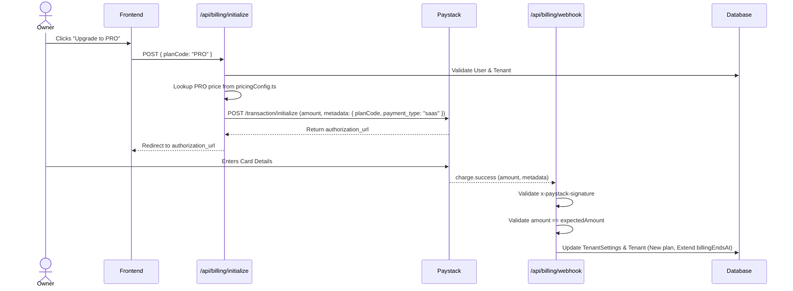
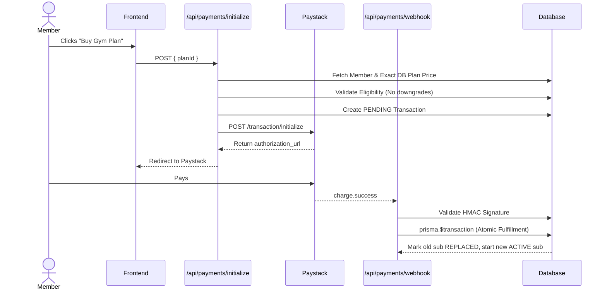

# CortexFit Billing Architecture

This document describes the billing architecture, subscription lifecycles, payment integration, and transition rules. 
The system operates on a **One-Time Charge Model** while simulating a recurring subscription lifecycle by requiring the user to manually renew. This applies to both **Member Billing** and **Platform SaaS Billing**.

## 1. Source of Truth

The single source of truth for pricing is **`lib/billing/pricingConfig.ts`** (and dynamically queried database records for MembershipPlans).
- **Hardcoding is strictly prohibited** (e.g. `amount = 25000` in the frontend).
- The UI MUST fetch prices dynamically.
- The webhook MUST NOT trust the amount from the client. It validates `expectedKobo === data.amount`.
- Configurable settings live in `pricingConfig.ts`:
  - `RENEWAL_WINDOW_DAYS`: 5
  - `EXPIRY_WARNING_DAYS`: 3
  - `GRACE_PERIOD_DAYS`: 7
  - `TRIAL_DURATION_DAYS`: 14

## 2. Platform SaaS Billing Flow

For gym owners paying for the platform (FREE, PRO, ENTERPRISE).
Legacy Paystack subscriptions (`subscription.create`) are **no longer used**.

### Sequence Diagram

## 3. Member Billing Flow

For gym members paying for memberships.

### Sequence Diagram

## 4. Subscription Transitions

All subscription changes happen atomically.

### Upgrades (Mid-cycle)
- **Rule**: No proration. Full price is charged.
- **Action**: The current `ACTIVE` subscription is marked as `REPLACED`.
- A brand new `ACTIVE` subscription is created starting *immediately*.

### Renewals (Near Expiry)
- If the user selects the same plan within the `RENEWAL_WINDOW_DAYS` (default 5).
- **Rule**: We do not penalize early renewals.
- **Action**: The new subscription starts exactly at the `endDate` of the current active subscription (dates stack).

### Expiration and Suspension Flow
- A cron job (`lifecycleEngine.ts`) checks `endDate` daily.
- Users receive emails `EXPIRY_WARNING_DAYS` (3 days) before expiry.
- When `endDate < now`, the subscription is naturally treated as expired by the frontend.
- While expired, a configurable `GRACE_PERIOD_DAYS` (7 days) applies before suspension or deletion.
- Suspended or inactive users instantly lose access to the gym features (Platform SaaS) or member dashboard (Members).
- Renewing after suspension starts a brand new billing cycle immediately, restoring access.

## 5. Webhook Validation & Idempotency

The unified webhook (`/api/payments/webhook`) enforces:
1. **Signature Verification**: Validates `x-paystack-signature` using HMAC SHA512.
2. **Amount & Currency Validation**: Ensures the payload amount exactly matches the backend calculated amount.
3. **Idempotency**:
   - Platform: `prisma.billingEvent` tracks event hashes.
   - Member: `transaction.status` ensures `PENDING` -> `SUCCESS` happens exactly once via `updateMany` count checks inside `$transaction`.
